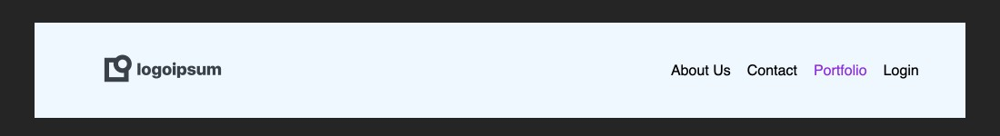

### Viewport Dimensions

1024px x 768px

### Header
* background color for the header is `aliceblue`

### Logo
* choose any logo at [logoipsum](https://logoipsum.com/)
* download it and include it in this exercise

### Font
* sans-serif
* color for most navs items is the default black
* color for the selected nav item is `blueviolet`
* default sizing for all nav items

### Objective

### Requirements
* use flexbox to build this navigation
