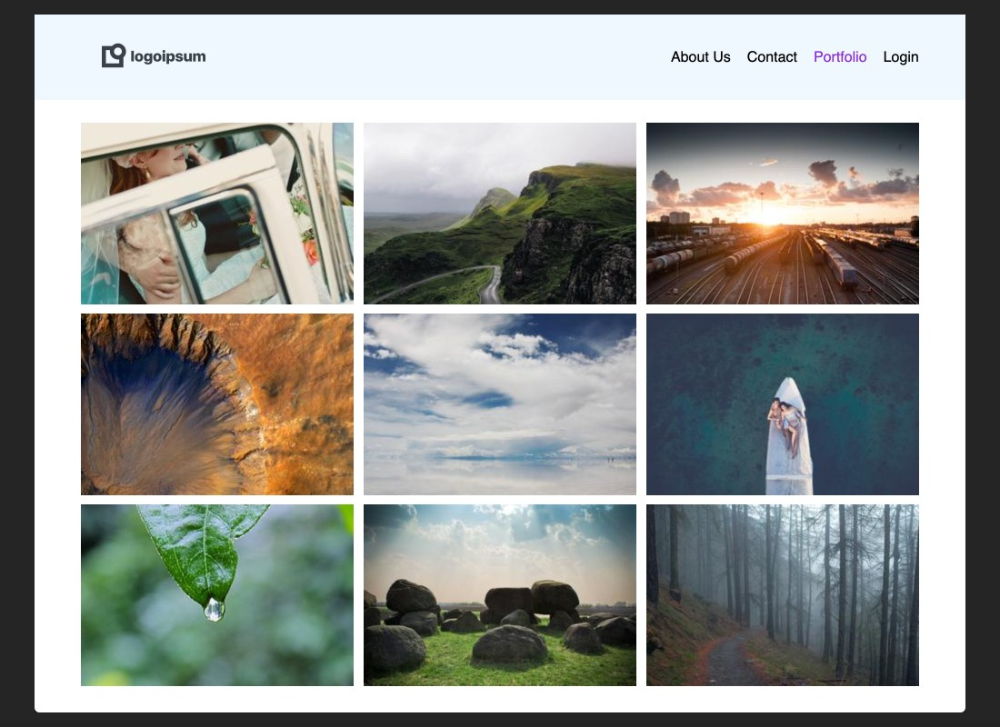
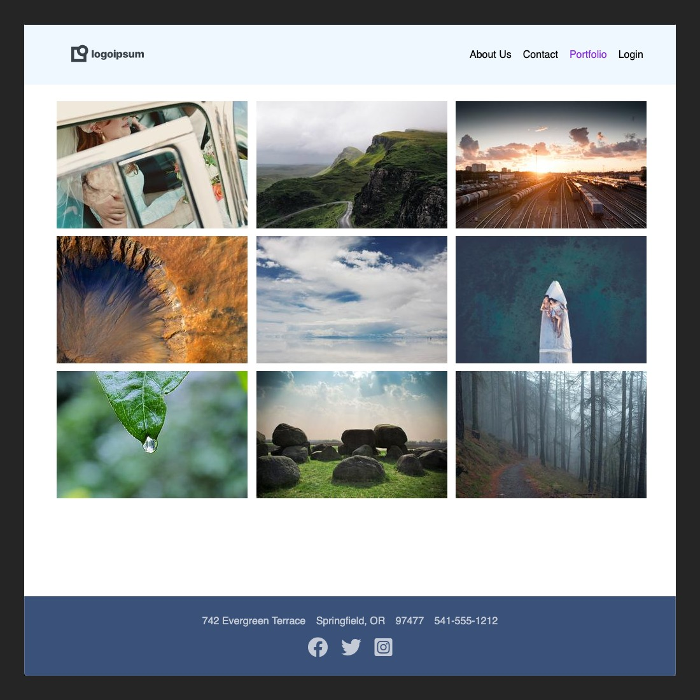

### Viewport Dimensions
1024px x 1024px

### HTML
* The HTML for this exercise is nearly complete
* You need only to account for multiple stylesheets

### CSS
* The CSS for this exercise is nearly complete
* Slight modifications are needed to create a sticky footer

### Objective
View at 1024px x 768px

View at 1024px x 1024px

### Requirements
* Modify the CSS with flexbox so that we have a sticky footer
* Separate the styles into six different style sheets
  - reset.css
  - base.css
  - layout.css
  - header.css
  - main.css
  - footer.css