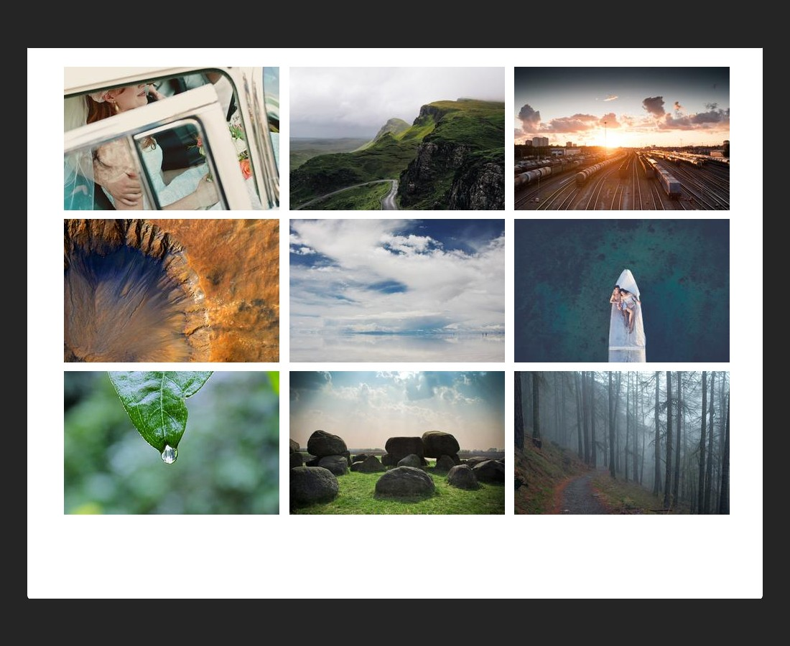

### Viewport Dimensions
1024px x 768px

### API for images
* read the documentation at [lorempicsum](https://picsum.photos/) in order to learn how to load the images listed by their `id` below
* the images should be 300px x 200px

### Image IDs
* 1013
* 1018
* 1026
* 1032
* 1056
* 1083
* 159
* 168
* 229

### `alt` tags for images
* wedding
* mountain road
* rail yard
* crater
* clouds
* couple in canoe
* leaf with droplet
* large stones in field
* foggy forest

### Objective

### Requirements
* use floats to build this navigation
