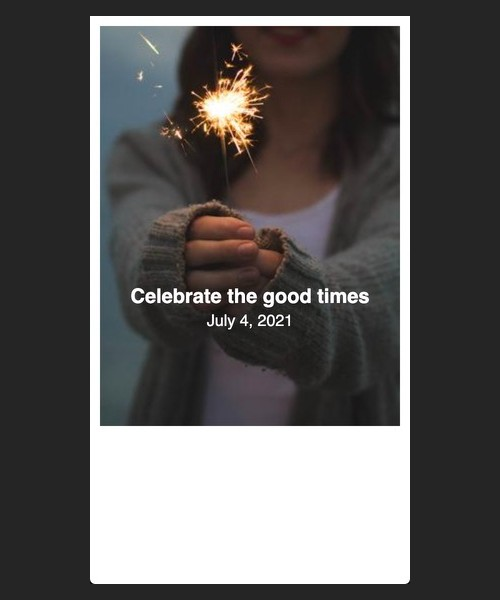

### Viewport Dimensions
320px x 568px

### Image
* https://picsum.photos/id/660/300/400
* centered horizontally
* resizing the image is not necessary

### Font
* sans-serif
* color is white

### Objective

### Stretch Goal
* make the space between the top of the image and the top edge of the viewport the same number of pixels as the space of the left and right margins of the centered image