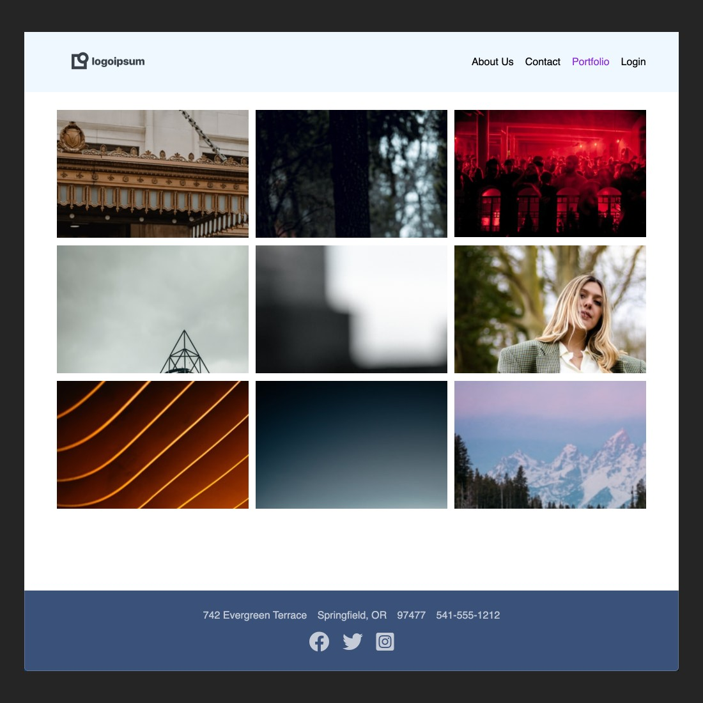

### Viewport Dimensions
1024px x 1024px

### Unsplash API
* To complete this assignment, you need a developer account at [Unsplash](https://unsplash.com/developers)

### Objective
Since random images are loaded, your screen will look different from this one but the point is that the default images have been replaced

### Requirements
* Using the APIs from Unsplash endpoints and JavaScript's `fetch`, replace the default images with random ones from Unsplash