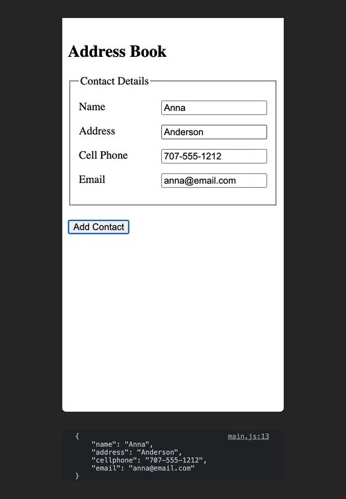

### CSS
CSS is provided.

### HTML
HTML is provided.

### JavaScript
Capture the values of each input when a user clicks _Add Contact_ and print them to the console as a string (not an object).

### Objective
