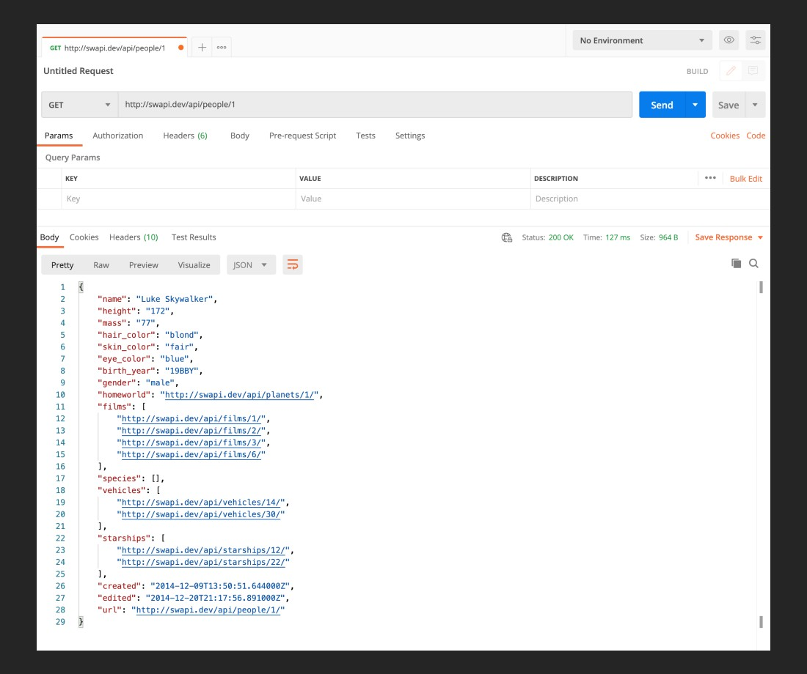

### Prerequisites
* Download [Postman](https://www.postman.com/downloads/)
* Install it and open it on your local

### Objective

### Requirements
* There is no code to write for this assignment but after watching the video, make a `GET` request in Postman to **https://swapi.dev/api/people/1/** and compare it to the objective above